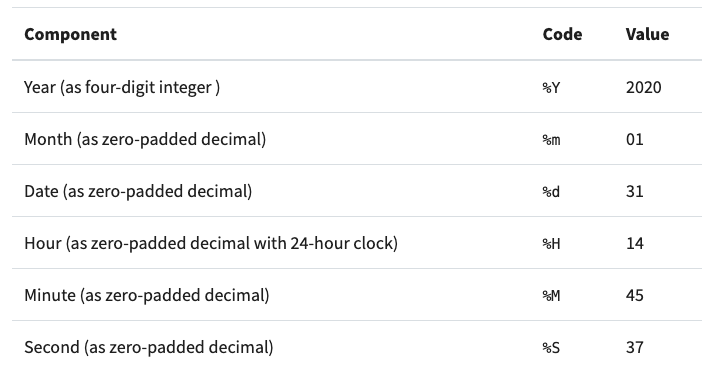

# Learning `datetime`


## Unix Time

Nearly all programming languages, including Python, incorporate the concept of Unix time. 
Python’s standard library includes a module called time that can print the number of seconds since the Unix epoch:

```python
import time
time.time()
```

## ISO 8601

To help avoid communication mistakes, the International Organization for Standardization (ISO) developed ISO 8601. 
This standard specifies that all dates should be written in order of most-to-least-significant data. 
This means the format is year, month, day, hour, minute, and second:

```
YYYY-MM-DD HH:MM:SS
```

## `time` Module

`time` is less powerful and more complicated to use than `datetime`. 
Many functions in `time` return a special `struct_time` instance. 
This object has a named tuple interface for accessing stored data, making it similar to an instance of `datetime`. 
However, 
it doesn’t support all of the features of datetime, especially the ability to perform arithmetic with time values.

## `datetime` Module 

`datetime` provides three classes that make up the high-level interface that most people will use:

- `datetime.date` is an idealized date that assumes the Gregorian calendar extends infinitely into the future and past. 
This object stores the year, month, and day as attributes.

- `datetime.time` is an idealized time that assumes there are 86,400 seconds per day with no leap seconds. 
This object stores the hour, minute, second, microsecond, and tzinfo (time zone information).

- `datetime.datetime` is a combination of a date and a time. 
It has all the attributes of both classes.

## Creating Python `datetime` Instances

The three classes that represent dates and times in datetime have similar initializers. 
They can be instantiated by passing keyword arguments for each of the attributes, such as year, date, or hour.

```python
>>> from datetime import date, time, datetime
>>> date(year=2020, month=1, day=31)
datetime.date(2020, 1, 31)
>>> time(hour=13, minute=14, second=31)
datetime.time(13, 14, 31)
>>> datetime(year=2020, month=1, day=31, hour=13, minute=14, second=31)
datetime.datetime(2020, 1, 31, 13, 14, 31)
```

Fortunately, `datetime` provides several other convenient ways to create datetime instances. 
These methods don’t require you to use integers to specify each attribute, 
but instead allow you to use some other information:

- `date.today()` creates a datetime.date instance with the current local date.

- `datetime.now()` creates a datetime.datetime instance with the current local date and time.

- `datetime.combine()` combines instances of datetime.date and datetime.time into a single datetime.datetime instance.

These three ways of creating datetime instances are helpful 
when you don’t know in advance what information you need to pass into the basic initializers.

```python
>>> from datetime import date, time, datetime
>>> today = date.today()
>>> today
datetime.date(2020, 1, 24)
>>> now = datetime.now()
>>> now
datetime.datetime(2020, 1, 24, 14, 4, 57, 10015)
>>> current_time = time(now.hour, now.minute, now.second)
>>> datetime.combine(today, current_time)
datetime.datetime(2020, 1, 24, 14, 4, 57)
```

## Using Strings to Create Python `datetime` Instances

Another way to create date instances is to use `.fromisoformat()`. 
To use this method, you provide a string with the date in the ISO 8601 format that you learned about earlier. 
For instance, you might provide a string with the year, month, and date specified:

```
2020-01-31
```

This string represents the date January 31, 2020, according to the ISO 8601 format. 
You can create a date instance with the following example:

```python
>>> from datetime import date
>>> date.fromisoformat("2020-01-31")
datetime.date(2020, 1, 31)
```

### `.strptime()`

But what if you have a string that represents a date and time but isn’t in the ISO 8601 format?

Fortunately, Python datetime provides a method called `.strptime()` to handle this situation. 
This method uses a special mini-language to tell Python 
which parts of the string are associated with the `datetime` attributes.

To construct a `datetime` from a string using `.strptime()`, 
you have to tell Python what each of the parts of the string represents using formatting codes from the mini-language. 
You can try this example to see how `.strptime()` works:

```
>>> date_string = "01-31-2020 14:45:37"
>>> format_string = "%m-%d-%Y %H:%M:%S"
```
On line 1, you create `date_string`, which represents the date and time January 31, 2020, at 2:45:37 PM. 
On line 2, you create `format_string`, which uses the mini-language 
to specify how the parts of `date_string` will be turned into datetime attributes.

In `format_string`, you include several formatting codes and all of the dashes (-), colons (:), 
and spaces exactly as they appear in `date_string`. 
To process the date and time in date_string, you include the following formatting codes:



A complete listing of all of the options in the mini-language is outside the scope of this tutorial, 
but you can find several good references on the web, 
including in Python’s documentation and on a website called [strftime.org](strftime.org).

Here’s an example of how `.strptime()` works:

```python
>>> from datetime import datetime
>>> datetime.strptime(date_string, format_string)
datetime.datetime(2020, 1, 31, 14, 45, 37)
```

### `.strftime()`

Python datetime has an additional method called `.strftime()` that allows you to format a datetime instance to a string. 
In a sense, it’s the reverse operation of parsing using `.strptime()`. 
You can differentiate between the two methods by remembering that the p in `.strptime()` stands for _parse_, 
and the f in `.strftime()` stands for _format_.

```python
pycon_date_str = PYCON_DATE.strftime("%A, %B %d, %Y at %H:%M %p %Z")
print(f"PyCon US 2021 will start on:", pycon_date_str)
print("Countdown to PyCon US 2021:", ", ".join(output))
```

## `timedelta`

Python `datetime` instances support several types of arithmetic. 
This relies on using `timedelta` instances to represent time intervals. 
`timedelta` is very useful because it’s built into the Python standard library. 
Here’s an example of how to work with timedelta:

```python
>>> from datetime import datetime, timedelta
>>> now = datetime.now()
>>> now
datetime.datetime(2020, 1, 26, 9, 37, 46, 380905)
>>> tomorrow = timedelta(days=+1)
>>> now + tomorrow
datetime.datetime(2020, 1, 27, 9, 37, 46, 380905)
```

```python
>>> yesterday = timedelta(days=-1)
>>> now + yesterday
datetime.datetime(2020, 1, 25, 9, 37, 46, 380905)
```

```python
>>> delta = timedelta(days=+3, hours=-4)
>>> now + delta
datetime.datetime(2020, 1, 29, 5, 37, 46, 380905)
```

In this example, you add three days and subtract four hours, so the new datetime is at January 29 at 5:37 AM. 
`timedelta` is very useful in this way, 
but it’s somewhat limited because it cannot add or subtract intervals larger than a day, 
such as a month or a year. 
Fortunately, `dateutil` provides a more powerful replacement called `relativedelta`.

## `relativedelta`

The basic syntax of `relativedelta` is very similar to timedelta. 
You can provide keyword arguments 
that produce changes of any number of years, months, days, hours, seconds, or microseconds. 
You can reproduce the first timedelta example with this code:

```python
>>> from dateutil.relativedelta import relativedelta
>>> tomorrow = relativedelta(days=+1)
>>> now + tomorrow
datetime.datetime(2020, 1, 27, 9, 37, 46, 380905)
```

In this example, you use `relativedelta` instead of `timedelta` to find the datetime corresponding to tomorrow. 
Now you can try adding five years, one month, and three days to now while subtracting four hours and thirty minutes:

```python
>>> delta = relativedelta(years=+5, months=+1, days=+3, hours=-4, minutes=-30)
>>> now + delta
datetime.datetime(2025, 3, 1, 5, 7, 46, 380905)
```

You can also use `relativedelta` to calculate the difference between two `datetime` instances. 
With `relativedelta`, instead of using the subtraction operator, 
you need to pass the two datetime instances as arguments :

```python
>>> now
datetime.datetime(2020, 1, 26, 9, 37, 46, 380905)
>>> tomorrow = datetime(2020, 1, 27, 9, 37, 46, 380905)
>>> relativedelta(now, tomorrow)
relativedelta(days=-1)
```

## 

```python

```

## 

```python

```

## 

```python

```

## 

```python

```

## 

```python

```

## 

```python

```

## 

```python

```

## 

```python

```

## Python `strftime` cheatsheet

Code	Example	& Description

* %a	Sun	Weekday as locale’s abbreviated name.
* %A	Sunday	Weekday as locale’s full name.
* %w	0	Weekday as a decimal number, where 0 is Sunday and 6 is Saturday.
* %d	08	Day of the month as a zero-padded decimal number.
* %-d	8	Day of the month as a decimal number. (Platform specific)
* %b	Sep	Month as locale’s abbreviated name.
* %B	September	Month as locale’s full name.
* %m	09	Month as a zero-padded decimal number.
* %-m	9	Month as a decimal number. (Platform specific)
* %y	13	Year without century as a zero-padded decimal number.
* %Y	2013	Year with century as a decimal number.
* %H	07	Hour (24-hour clock) as a zero-padded decimal number.
* %-H	7	Hour (24-hour clock) as a decimal number. (Platform specific)
* %I	07	Hour (12-hour clock) as a zero-padded decimal number.
* %-I	7	Hour (12-hour clock) as a decimal number. (Platform specific)
* %p	AM	Locale’s equivalent of either AM or PM.
* %M	06	Minute as a zero-padded decimal number.
* %-M	6	Minute as a decimal number. (Platform specific)
* %S	05	Second as a zero-padded decimal number.
* %-S	5	Second as a decimal number. (Platform specific)
* %f	000000	Microsecond as a decimal number, zero-padded on the left.
* %z	+0000	UTC offset in the form ±HHMM[SS[.ffffff]] (empty string if the object is naive).
* %Z	UTC	Time zone name (empty string if the object is naive).
* %j	251	Day of the year as a zero-padded decimal number.
* %-j	251	Day of the year as a decimal number. (Platform specific)
* %U	36	Week number of the year (Sunday as the first day of the week) as a zero padded decimal number. All days in a new year preceding the first Sunday are considered to be in week 0.
* %W	35	Week number of the year (Monday as the first day of the week) as a decimal number. All days in a new year preceding the first Monday are considered to be in week 0.
* %c	Sun Sep 8 07:06:05 2013	Locale’s appropriate date and time representation.
* %x	09/08/13	Locale’s appropriate date representation.
* %X	07:06:05	Locale’s appropriate time representation.
* %%	%	A literal '%' character.


## Credits

- [real python | Using Python datetime to Work With Dates and Times](https://realpython.com/python-datetime/)
- []()